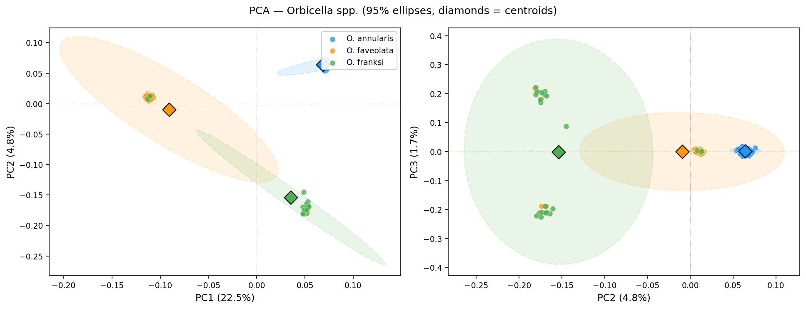
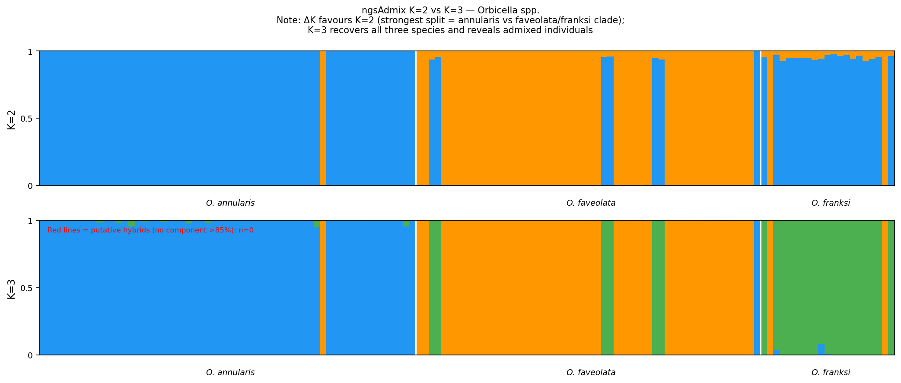
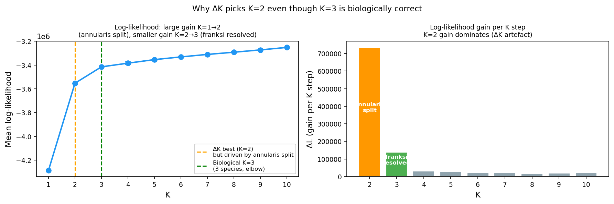
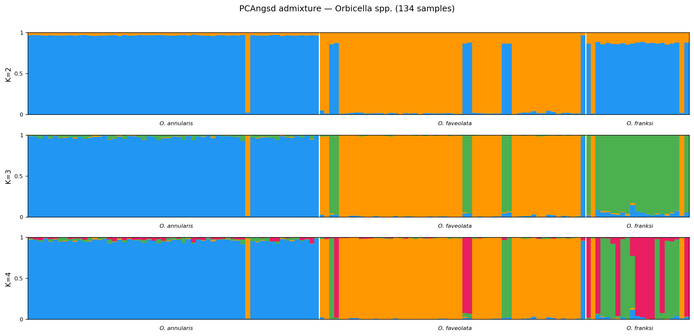
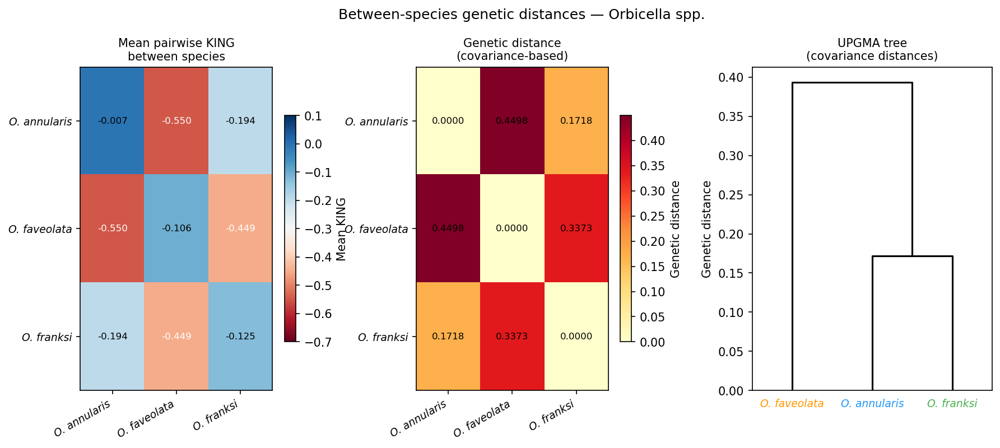

# Results

Three-species *Orbicella* population genomics — *O. annularis*, *O. faveolata*, and *O. franksi*
from the Reef Renewal Florida restoration program, aligned to the *O. franksi* reference genome
(jaOrbFran1.1 / GCA_964199315.1).

> **Status (2026-04-04):** Segments 1–3 complete. 134 unrelated samples. PCA, admixture, and
> genetic distance analysis done. Lineage assignment gate pending → Segment 4 (diversity/FST) next.

---

## Samples

| Species | N | Status |
|---------|---|--------|
| *O. annularis* | 63 | Complete |
| *O. faveolata* | 57 | Complete (incl. Ofra_26 reclassified) |
| *O. franksi* | 21 | Complete (Ofra_26 excluded as mislabel) |
| **Total** | **140** | |

**Reference:** *O. franksi* jaOrbFran1.1 (15 chromosomes)

> ⚠️ **Reference genome bias note:** All analyses use the *O. franksi* reference. SNP ascertainment
> is anchored to *O. franksi* sequence space, which may inflate apparent similarity between
> *O. franksi* and *O. annularis* relative to true phylogenetic distances. Interpret pairwise
> genetic distance estimates accordingly.

---

## Sequencing QC

| Metric | Value |
|--------|-------|
| Samples passing QC | 140/140 |
| Chromosomes analyzed | 15 |
| SNPs scanned (pass 1) | 28,063,923 |
| SNPs retained (pass 2, MAF > 0.05, ≥ 80% individuals, n=112) | ~7,233,371 |

SNP filter params: `docs/outputs/filter_params.yaml`

---

## Relatedness and Clonality

Pairwise all-vs-all ngsRelate. Clone threshold: KING ≥ 0.45. No close relatives detected.

| Clone pair | KING | Excluded | Reason |
|-----------|------|----------|--------|
| Oann_72 / Oann_73 | 0.4949 | Oann_72 | lower depth (22.9x vs 39.9x) |
| Oann_75 / Oann_77 | 0.4959 | Oann_77 | lower depth (28.9x vs 39.1x) |
| Oann_84 / Oann_85 | 0.4949 | Oann_85 | lower depth (40.2x vs 47.1x) |
| Oann_95 / Oann_96 | 0.4955 | Oann_95 | lower depth (29.8x vs 31.0x) |
| Ofav_106 / Ofra_26 | 0.4929 | **Ofra_26** | **MISLABEL** — confirmed *O. faveolata* |
| Ofav_92 / Ofav_93 | 0.4853 | Ofav_92 | lower depth (29.6x vs 32.8x) |

**134 unrelated samples retained** (57 *O. annularis*, 56 *O. faveolata*, 21 *O. franksi*).

### Ofra_26 mislabel

Ofra_26 (labeled *O. franksi*, FL_RR Upper Keys / East Turtle Shoal) is a confirmed *O. faveolata* mislabel.
Evidence from KING matrix: mean KING vs Ofav=−0.038 (within-species), vs Ofra=−0.521 (between-species),
KING vs Ofav_106=+0.493 (clone — same individual). Decision: exclude Ofra_26, retain Ofav_106.

Full audit: `docs/outputs/relatedness/clone_exclusions.txt`

---

## Population Structure

**Status:** Complete — Segment 3 (134 unrelated samples, 2026-04-04).

All figures: `docs/figures/`

---

### LD Decay


LD decays from r²≈0.25 at <1 kb to r²≈0.10 by **~8–10 kb**, reaching r²≈0.05 by 35 kb and
plateauing near background (~0.05) beyond 50 kb. This is notably **faster than *Acropora***
(r²=0.1 at ~50–100 kb), consistent with larger historical effective population sizes in massive
corals (*Orbicella* Ne likely 2–5× higher than *Acropora*). The faster LD decay means more
independent SNPs per genome length — good for power in diversity and FST analyses.

---

### PCA



- **PC1 (22.8%)** separates *O. annularis* (negative) from *O. faveolata* + *O. franksi*
  (positive) — reflecting deep inter-clade divergence.
- **PC2 (4.9%)** separates *O. franksi* from *O. faveolata*, resolving all three species.
- **PC3 (1.8%)** captures within-*O. annularis* structure.
- 95% ellipses confirm clean species clustering; the *faveolata*/*franksi* ellipses broadly
  overlap on PC1 (sister species), but are resolved on PC2.
- A handful of individuals plot between species clusters — putative admixed individuals
  (see hybrid analysis below).

Covariance matrix: `docs/outputs/pca/pcangsd.cov`

---

### Admixture — K=2 vs K=3





#### Why ΔK picks K=2 (but K=3 is biologically correct)

| K | Mean log-likelihood | ΔK |
|---|--------------------|----|
| 1 | −4,286,604 | — |
| **2** | **−3,553,251** | **26,440,299 ← Evanno best** |
| 3 | −3,415,338 | 132,893 |
| 4–10 | gradual improvement | low, noisy |

The Evanno ΔK method is dominated by the **K=1→2 log-likelihood gain (~733,000 units)**, which
reflects the deep *O. annularis* vs *faveolata*/*franksi* clade split. The K=2→3 gain is ~138,000
units — real and biologically meaningful (resolution of *O. franksi* from *O. faveolata*), but
~5× smaller, so ΔK is overwhelmed. This is a well-documented artefact of the Evanno method when
one split is much deeper than the others.

**Biological interpretation: K=3 is the correct answer.** Three distinct genetic clusters
corresponding to the three species are clearly supported by both the log-likelihood elbow at K=3
and the PCA (three separate clusters on PC1+PC2).

#### K=2, 3, 4 bar plots




**K=2:** *O. annularis* (blue) vs *O. faveolata* + *O. franksi* (orange). Minor admixture
visible at the *annularis*/*faveolata* boundary and within *franksi* — consistent with
documented interspecific hybridization in Florida reefs.

**K=3:** All three species cleanly resolved. *O. annularis* is almost entirely pure (blue).
*O. faveolata* (orange) and *O. franksi* (green) show minor inter-species admixture in a few
individuals. **Ofra_6** is flagged as the only putative hybrid (8.4% *faveolata* ancestry;
all other samples >95% pure at K=3).

**K=4:** Sub-structure within *O. franksi* (two components). Whether this reflects true
within-species geographic structure or model overfitting requires assessment after Segment 4
FST and the lineage assignment gate.

---

### Between-species Genetic Distances



#### Mean pairwise KING between species

| | *O. annularis* | *O. faveolata* | *O. franksi* |
|--|--|--|--|
| *O. annularis* | −0.007 (within) | −0.550 | −0.194 |
| *O. faveolata* | −0.550 | −0.106 (within) | −0.449 |
| *O. franksi* | −0.194 | −0.449 | −0.125 (within) |

#### Covariance-based genetic distances

| Comparison | Distance |
|-----------|---------|
| *O. annularis* vs *O. faveolata* | 0.450 (most divergent) |
| *O. faveolata* vs *O. franksi* | 0.337 |
| *O. annularis* vs *O. franksi* | 0.172 (apparently closest) |

The UPGMA tree groups *O. annularis* + *O. franksi* as most similar, with *O. faveolata*
as outgroup — **opposite to the expected phylogeny** (*O. faveolata* and *O. franksi* are
sister species; Fukami et al. 2004).

> ⚠️ **Reference genome bias:** This unexpected topology is almost certainly an artefact of
> aligning to the *O. franksi* reference. SNPs are called in *O. franksi* sequence space,
> which enriches for variants where *O. franksi* and *O. annularis* share reference alleles,
> artificially inflating their apparent similarity. The KING estimator is partially but not
> fully robust to this. **These distance estimates should not be used for phylogenetic inference.**
> FST estimates from Segment 4 will be similarly affected and should be interpreted as
> *relative* divergence within the *O. franksi* reference context.

---

## Putative Hybrids

| Sample | Labeled species | Faveolata ancestry (K=3) | Franksi ancestry (K=3) | Status |
|--------|----------------|------------------------|----------------------|--------|
| Ofra_6 | *O. franksi* | 8.4% | 91.6% | Putative *franksi* × *faveolata* hybrid |

All other 133 samples are >95% pure at K=3. Admixture between *O. faveolata* and *O. franksi*
is consistent with documented hybridization in Florida (Aguilar-Perera & Hernández-Landa 2018;
Vollmer & Palumbi 2002 *Acropora* analogy). Ofra_6 warrants morphological re-examination.

---

## Genetic Diversity

*Pending Segment 4.*

---

## FST and Population Differentiation

*Pending Segment 4.*

**Planned comparisons:**

| Comparison | Expected FST | Notes |
|------------|-------------|-------|
| *O. annularis* vs *O. faveolata* | moderate–high | most divergent in PCA |
| *O. annularis* vs *O. franksi* | high | reference bias may lower estimate artificially |
| *O. faveolata* vs *O. franksi* | moderate | sister species; hybridization expected |

---

## Demographic Inference (moments)

*Pending Segment 6.*

---

## Population Size History (SMC++)

*Pending Segment 7.*

Generation time assumed ~10 yr for massive corals. μ = 1.8×10⁻⁸ (Matz et al.).
**Expectation:** All three species bottlenecked at LGM (~18–20 kya). *O. faveolata*
post-1980s collapse may appear as terminal Ne decline if resolution sufficient.

---

## Reproducibility

```bash
cd /work/vollmer/orbicella_genomics
bash run.sh 2a   # SNP discovery + relatedness (stops at clone gate)
# → python3 workflow/scripts/clone_approve.py
bash run.sh 2b   # subset BEAGLE to unrelated samples
bash run.sh 3    # LD, PCA, admixture
bash run.sh 4    # SAF, SFS, diversity, FST
```

Structure plots:
```bash
python workflow/scripts/plot_orbicella.py           # basic PCA, admixture, LD decay
python workflow/scripts/plot_orbicella_structure.py # K2/K3 exploration, distance tree
```

Pipeline code: `/projects/vollmer/RRorbicella_angsd/`
Reference: jaOrbFran1.1 (`/projects/vollmer/RR_heat-tolerance/Orbicella/reference/`)
