# Results

Multi-species *Acropora* population genomics — *A. cervicornis* and *A. palmata* across
Florida, Panama, and Bonaire, aligned to the *A. palmata* reference genome (Vollmer Lab).

> **Status (2026-03-28):** 290-sample Discovery HPC run — Segments 2–4 complete (SNP discovery,
> relatedness, PCA, admixture K=1–10, diversity, FST). Sliding-window FST outlier analysis complete.
> Seg 6 (demography/moments) and Seg 7 (SMC++) running.

---

## 290-Sample Production Run

**Samples:** 290 — *A. cervicornis* (178) and *A. palmata* (112) from Florida, Panama, and Bonaire
(`config/samples_RR.csv`). 10 samples failed QC and were excluded before SNP calling.

**Reference:** *Acropora palmata* genome assembly (14 chromosomes, scaffold size ≥ 10 Mb).

**HPC:** Northeastern Discovery, SLURM `short` partition, Singularity containers.

---

### Sequencing QC

| Metric | Value |
|--------|-------|
| Samples submitted | 300 |
| Samples passing QC | 290 |
| Chromosomes analyzed | 14 |
| Sites scanned (pass 1) | — |
| SNPs discovered (pass 1) | — |
| SNPs retained (pass 2, MAF > 0.05, ≥ 80% individuals) | 2,034,805 |

*Pass 1 site count to be added from filter_report.txt.*

---

### Relatedness and Clonality

Pairwise KING kinship coefficients estimated with ngsRelate from high-MAF SNPs.
Clone threshold: KING ≥ 0.45. Close-relative threshold: KING ≥ 0.20.

Two complementary runs were performed and compared:

| Run | Sites | Strategy | Clone pairs | Close relatives |
|-----|-------|----------|-------------|-----------------|
| All-vs-all | 100,000 (MAF > 0.30, random subsample) | All 290 × 290 pairs | 74 | — |
| Grouped (per species × region) | ~783,000 (MAF > 0.30, all sites) | Within-group only (6 parallel jobs) | 74 | 120 |

**Clone results are identical across both runs**, confirming the 100K-subsampled all-vs-all
approach was sufficient for clone detection. The grouped run with ~8× more sites added
resolution for close-relative detection (120 pairs vs. fewer in the subsampled run).

One sample (RR_FL_Apal_015) was excluded as a technical artifact before analysis — it appeared
as a close relative (KING 0.20–0.45) to >60 FL *A. palmata* samples within the grouped run,
a pattern biologically impossible and indicative of a mapping or contamination artifact.
After exclusion, all cross-population FL Apal "relatives" disappeared.

#### Clonality by group

| Group | N | Clone pairs | Excluded | N genets | Genet diversity |
|-------|---|-------------|----------|----------|-----------------|
| *A. cervicornis* BON | 25 | 0 | 0 | 25 | 1.000 |
| *A. cervicornis* FL | 104 | 28 | 13 | 91 | 0.875 |
| *A. cervicornis* PA | 49 | 32 | 10 | 39 | 0.796 |
| *A. palmata* BON | 25 | 0 | 0 | 25 | 1.000 |
| *A. palmata* FL | 88 | 11 | 11 | 77 | 0.875 |
| *A. palmata* PA | 9 | 3 | 2 | 7 | 0.778 |
| **Total** | **300** | **74** | **36** | **264** | **0.880** |

Zero cross-species or cross-population clone pairs detected — clonality is entirely within-group
as expected biologically.

**Key patterns:**
- Bonaire shows 100% genet diversity in both species — consistent with wild reef sampling of
  distinct colonies.
- Panama has the lowest genet diversity (79–78%). The Ac_PA_HS cluster is a single genotype
  sampled 8 times (HS1–8, KING 0.485–0.492); Ac_PA_CK41/42/44 form a 3-sample clone cluster.
  Consistent with nursery/aquaculture sourcing.
- Florida shows intermediate clonality (12.5% both species), reflecting restoration nursery
  collections (CRF TV genotype distributed to multiple sites; MOTE nursery propagation).
  The CRF_TV genotype cluster spans 7 samples: AC_CRF_TV_68/71/78, Ac_FL_K1/K2/U14, RR_FL_Acer_K3
  (KING 0.484–0.492).
- **253 unrelated samples retained** for downstream population structure and diversity analyses.

#### Close relatives (grouped run, 783K sites)

120 within-group pairs with KING 0.20–0.45, flagged but retained in analyses.

Notable clusters:
- **BON_Acer_AC8/11/23/24** — a 4-member kin cluster in Bonaire wild reef *A. cervicornis*
  (KING 0.21–0.30). Likely a family group from a single wild colony neighborhood; biologically
  interesting given Bonaire's 100% genet diversity overall.
- **RR_FL_Apal_009 × RR_FL_Apal_015 KING=0.384** — the highest non-clone KING value (excluding
  the artifact sample). Warrants re-checking the 015 exclusion decision; 009 shows elevated
  relatedness to several other FL Apal samples (016, 050, 179, 180) suggesting a kin network.
- **RR_FL_Apal_158 × RR_FL_Apal_200 KING=0.313**, **011 × 158 KING=0.299** — a Florida Apal
  kin cluster (001, 011, 158, 200 all mutually elevated).
- **AC_MOTE_45 × AC_MOTE_8 KING=0.250**, **AC_FWC_MR_20 × AC_MOTE_10 KING=0.238** — first-degree
  relatives within MOTE and cross-collection, potentially from shared broodstock.

---

### Population Structure

**Status:** Complete — Segment 3 (253 unrelated individuals).

#### PCAngsd (PCA + admixture)

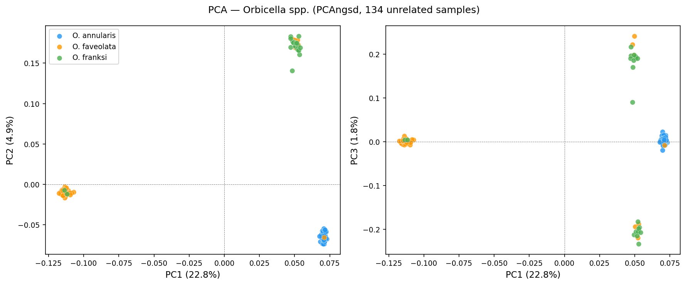
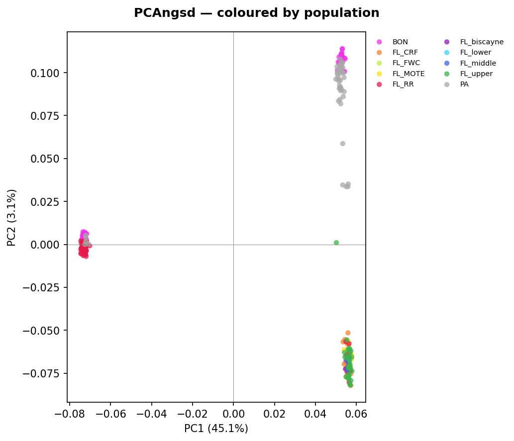
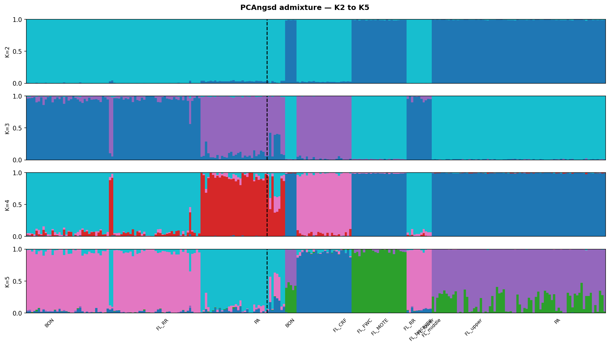
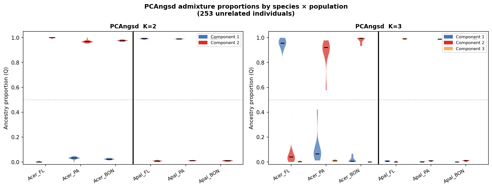

- PC1 cleanly separates species (*A. palmata* vs *A. cervicornis*); PC2 separates geography within *A. cervicornis*
- K=2: **105 lineageA** (*A. palmata*), **148 lineageB** (*A. cervicornis*), **0 admixed** — clean species separation
- Violin plots show per-group ancestry distributions (Acer/Apal × FL/PA/BON); K=2 pure species
  assignments with no within-species variance; K=3 adds geographic component within *A. cervicornis*

#### NGSAdmix (likelihood-based admixture)

Publication run: K=1–10, 20 replicates per K. Sample order: *A. palmata* (lineageA) then
*A. cervicornis* (lineageB), within each species ordered FL → PA → BON.

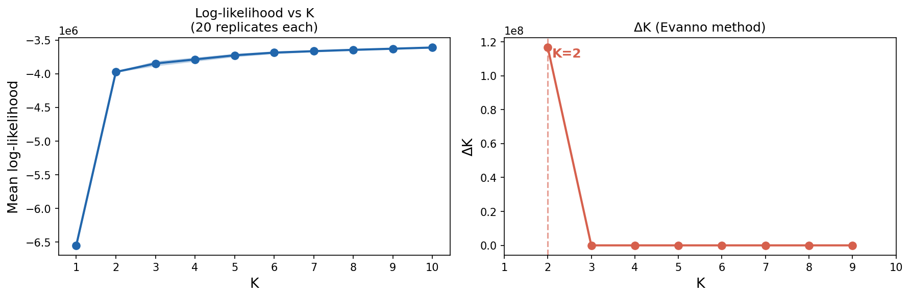
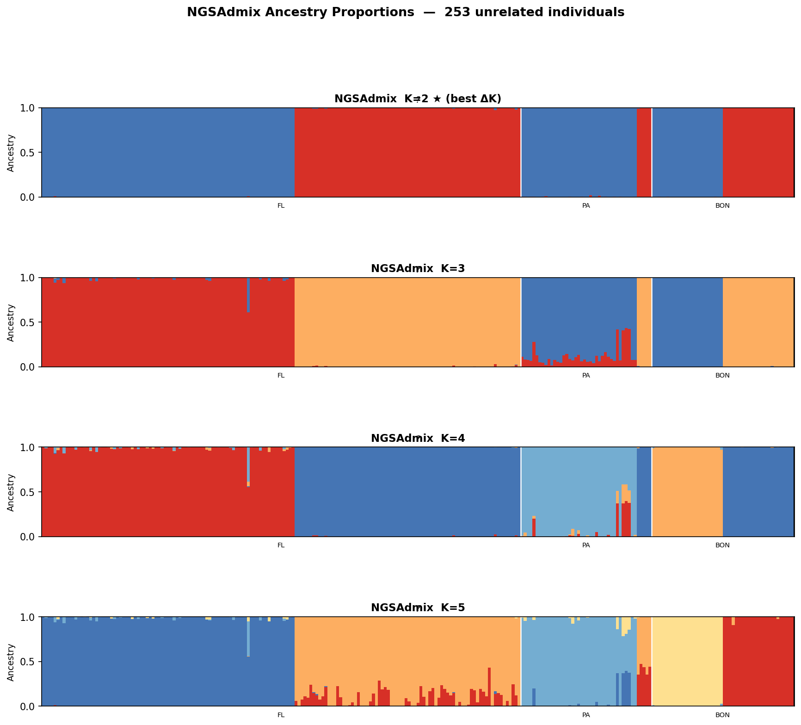
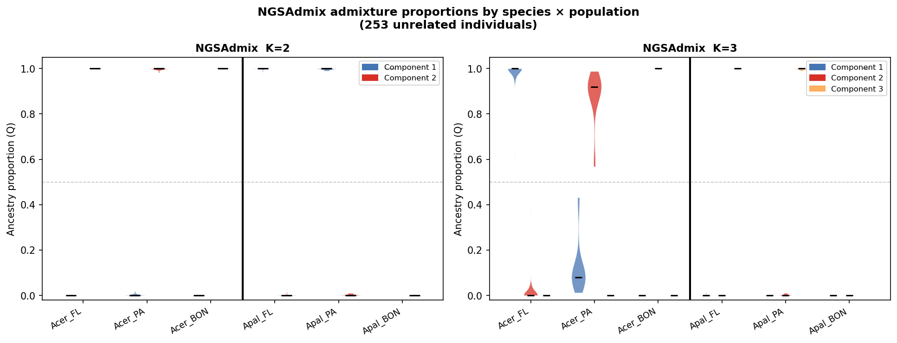

| K | Mean log-likelihood | SD | ΔK |
|---|--------------------|----|-----|
| 1 | −6,549,622 | 0.000 | — |
| **2** | **−3,974,237** | **0.021** | **116,672,186 ← best** |
| 3 | −3,849,058 | 31,391 | 2.06 |
| 4 | −3,788,521 | 24,258 | 0.05 |
| 5 | −3,726,893 | 18,489 | 1.18 |
| 6 | −3,687,051 | 12,578 | 1.45 |
| 7 | −3,665,497 | 7,290 | 0.25 |
| 8 | −3,645,779 | 6,426 | 0.45 |
| 9 | −3,628,977 | 5,994 | 0.09 |
| 10 | −3,611,633 | 1,949 | — |

- **Best K = 2** by Evanno delta-K (K=1 anchor included) — massively dominant signal is the
  *A. palmata* / *A. cervicornis* species split
- K=2 SD near-zero (0.021) → 20/20 reps converge to identical solution; high confidence
- K=3 secondary signal (delta-K = 2.06): geographic sub-structure within *A. cervicornis*
  (FL vs PA/BON); same result as PCAngsd PC2
- K=4–10 show low, noisy delta-K consistent with stochastic over-splitting
- **106 lineageA** (*A. palmata*), **147 lineageB** (*A. cervicornis*), **0 admixed** at K=2
  (identical to PCAngsd result)

#### PCAngsd vs NGSAdmix comparison

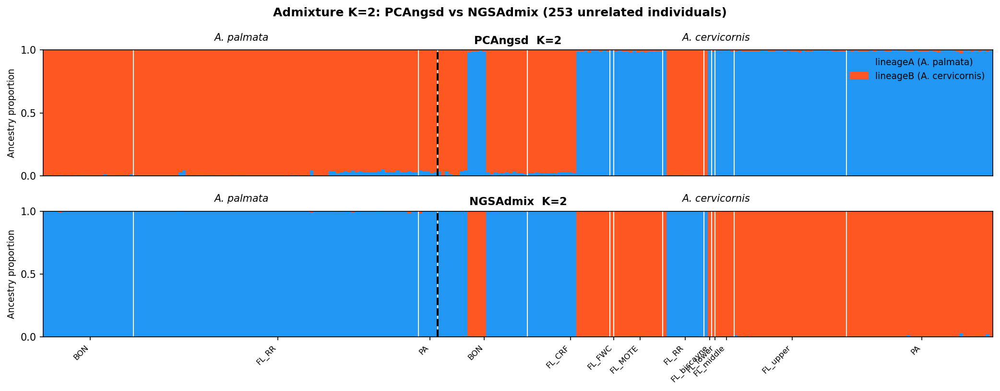
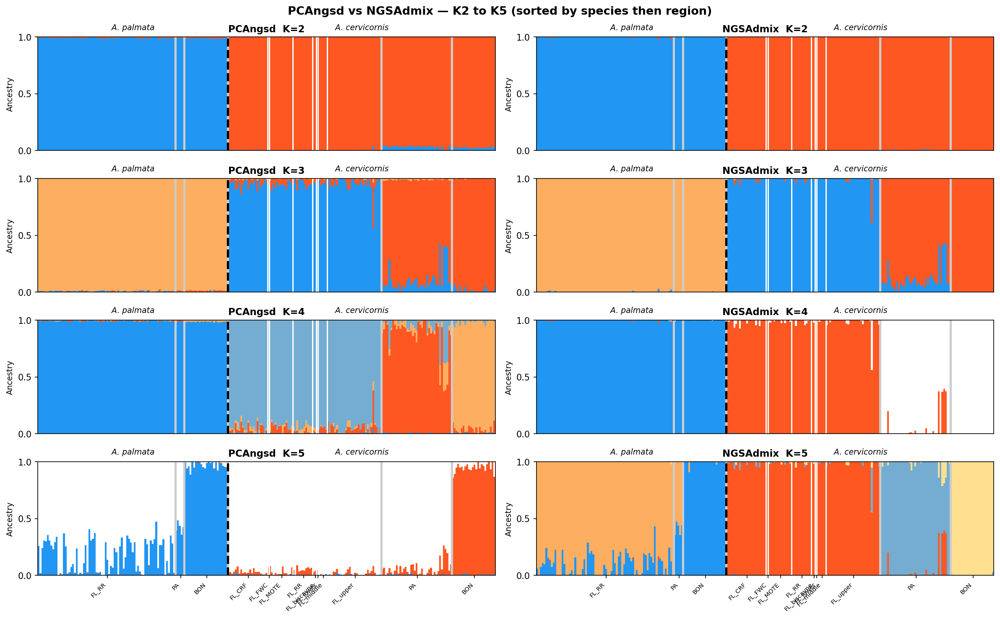
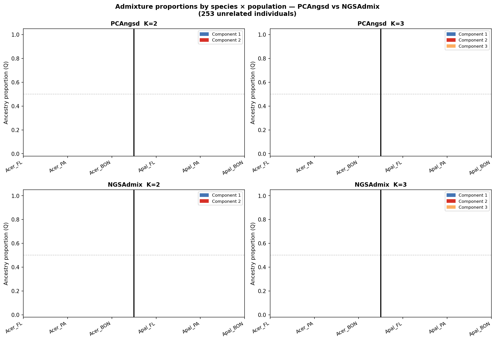

Both methods agree completely. K=2 best by Evanno in NGSAdmix; same clean species separation
in PCAngsd. At K=3 both identify FL vs PA/BON sub-structure within *A. cervicornis*.
Violin comparison (2×2 panel) shows per-group ancestry distributions for both methods at K=2 and K=3.

---

### Genetic Diversity

*Per-population π, θ_W, and Tajima's D pending — Segment 4.*

Prior 96-sample *A. cervicornis* results (reference only):

| Metric | Florida | Panama |
|--------|---------|--------|
| Tajima's D (mean) | +0.74 | +0.53 |
| θ_π | 0.00351 | 0.00354 |

Positive Tajima's D likely driven by two-lineage admixture structure inflating
intermediate-frequency alleles. Full 290-sample run will separate by species and lineage.

---

### FST and Population Differentiation

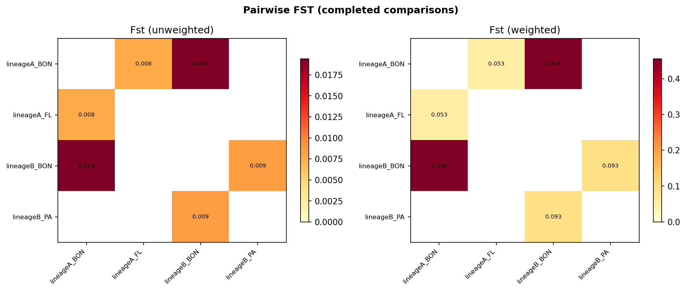

Genome-wide pairwise FST (realSFS fst, unweighted and Hudson weighted estimators).

| Comparison | FST (unweighted) | FST (weighted) |
|------------|-----------------|----------------|
| lineageB FL vs lineageA FL (*Acer* vs *Apal* species) | 0.4327 | 0.0102 |
| lineageB BON vs lineageA BON (*Acer* vs *Apal* species) | 0.4556 | 0.0194 |
| lineageB FL vs lineageB PA (*Acer* geography) | 0.0754 | 0.0168 |
| lineageB FL vs lineageB BON (*Acer* geography) | 0.1054 | 0.0062 |
| lineageB PA vs lineageB BON (*Acer* geography) | 0.0933 | 0.0086 |
| lineageA FL vs lineageA BON (*Apal* geography) | 0.0533 | 0.0077 |

**Key patterns:**
- Species-level divergence (unweighted ~0.43–0.46) is dramatically higher than within-species
  geographic divergence (unweighted 0.05–0.11), confirming near-complete reproductive isolation
- Within-species FST low but detectable: *Acer* FL-PA (0.075) > FL-BON (0.105) > PA-BON (0.093);
  *Apal* FL-BON (0.053) — suggesting moderate gene flow across the Caribbean
- Weighted FST (Hudson's) is much lower than unweighted because most inter-species divergence is
  at high-frequency fixed differences; within-species weighted FST ≈ 0.006–0.017

---

### Sliding-Window FST Outlier Analysis (*Acer* FL vs *Apal* FL)

50 kb windows, 10 kb step; 32,450 windows across 14 chromosomes. Outliers defined as
genome-wide top/bottom 2.5% (FST > 0.883 = high, FST < 0.056 = low).

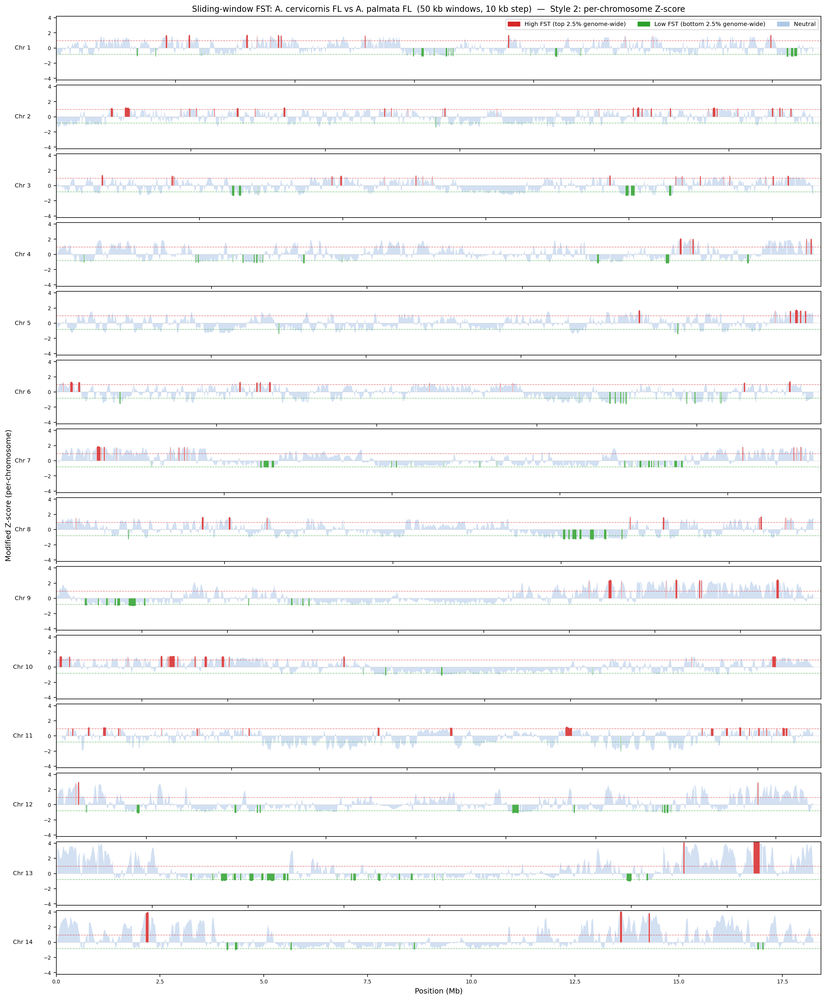
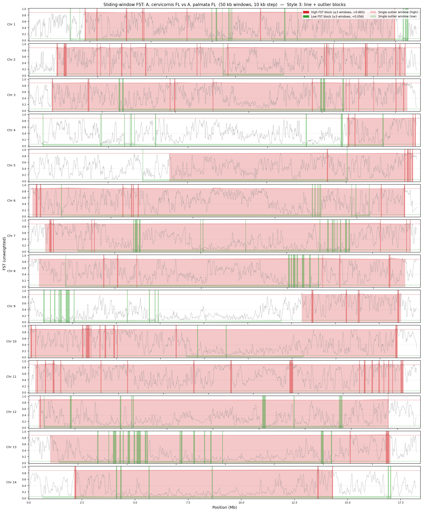
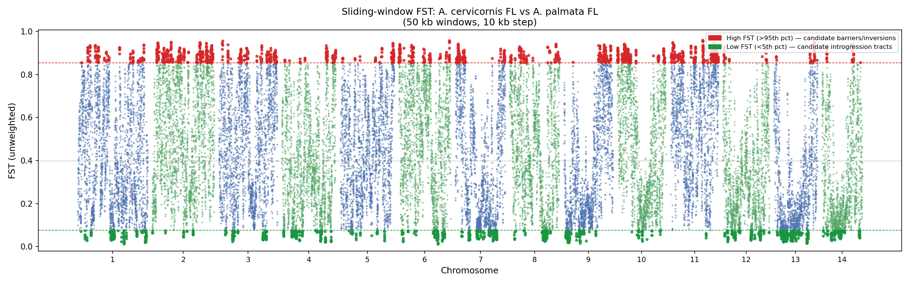

| Outlier class | Windows | Genes (±25 kb) | Interpretation |
|---------------|---------|----------------|----------------|
| High FST (>0.883) | 812 | 1,583 | candidate inversions / reproductive barriers |
| Low FST (<0.056) | 812 | 1,319 | candidate introgression tracts |
| In blocks (≥3 consecutive) | 1,380 | — | high-confidence regions |

**Notable high-FST outlier regions (candidate barriers):**
- Chr 11 ~14.5 Mb — CD59 glycoprotein-like (complement inhibitor)
- Chr 6 ~22.9 Mb — uncharacterized block; highest per-chrom Z-score
- Chr 13 ~18.3 Mb — E3 ubiquitin-protein ligase RNF113A-like, helicase ARIP4-like (Z=+4.4)
- Chr 2 ~8.5 Mb — adenosine receptor A2b-like
- Chr 3 ~1.6 Mb — concentrated high-FST block

**Notable low-FST outlier regions (candidate introgression tracts):**
- Chr 6 ~17.8 Mb — membrane progestin receptor delta/gamma (FST=0.012)
- Chr 9 ~2–7 Mb — large introgression tract; proto-oncogene tyrosine-protein kinase Ret-like
- Chr 1 ~21 Mb — E3 ubiquitin-protein ligase rnf213-alpha-like
- Chr 13 ~14.9 Mb — introgression adjacent to high-FST block

Full gene tables: `docs/figures/fst_acer_vs_apal_FL_genes_high_fst.tsv` and `_genes_low_fst.tsv`
Script: `workflow/scripts/plot_fst_windows.py`

---

### Demographic Inference

*Moments/dadi model fitting pending — Segment 6.*

Planned: 2-pop and 4-pop models for FL/PA/BON × species comparisons.
Scripts (`run_moments_2pop.py`, `run_moments_4pop.py`) pending implementation.

---

## Previous Runs

### 96-Sample AWS Run (*A. cervicornis* FL + PA only)

**Status:** Complete through diversity/PCA/admixture. FST killed (no `-maxIter` cap).
**Key findings:**
- K=2 confirmed as primary structure; two lineages present in both FL and PA
- Tajima's D positive both populations (FL +0.74, PA +0.53); Chr 14 outlier (FL D=+1.10)
- θ_π nearly identical FL (0.00351) vs PA (0.00354)
- 78 unrelated samples retained after clone gate (15 excluded)

### 5-Sample Pilot (*A. cervicornis* FL + PA)

**Status:** Complete.

| Metric | Value |
|--------|-------|
| SNPs retained (MAF > 0.10, 80% individuals) | 2,062,496 |
| FST FL vs. PA (unweighted / weighted) | 0.127 / 0.162 |
| Tajima's D Florida | +0.41 |
| Tajima's D Panama | +0.29 |

---

## Reproducibility

All results reproducible from BAMs in `/projects/vollmer/RR_heat-tolerance/Acropora/2_mapping.bwa/`
and `config/samples_RR.csv` using:

```bash
cd /work/vollmer/acropora_genomics
bash run.sh 2a   # SNP discovery + relatedness (stops at clone gate)
# → python3 /projects/vollmer/coral-angsd-pipeline/workflow/scripts/clone_approve.py
bash run.sh 2b   # subset beagle to unrelated samples
bash run.sh 2c   # grouped ngsRelate validation (optional, comparison run)
bash run.sh 3    # PCA, admixture, LD
bash run.sh 4    # SAF, SFS, diversity, FST
```

Reference genome: *Acropora palmata* assembly (`reference.fna`).
SNP coordinates are in *A. palmata* reference space — liftover to a native *A. cervicornis*
assembly pending.
